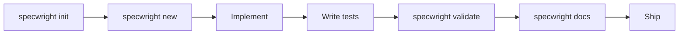

# Real-World Project Walkthrough

This example walks through a complete Specwright workflow: scaffold a project, generate components, implement them, validate coverage, and produce documentation.

## Step 1: Scaffold the Project

```bash
$ specwright init user_service
Created project 'user_service':
  user_service/
    pyproject.toml
    .specwright.toml
    README.md
    user_service/
      __init__.py
    tests/
      __init__.py
    examples/

Next steps:
  cd user_service
  specwright new function my_function
  specwright new statemachine my_workflow
```

```bash
$ cd user_service
```

## Step 2: Generate a Function

```bash
$ specwright new function create_user \
    --params "email: str, name: str, age: int" \
    --returns dict
Created create_user.py
Created tests/test_create_user.py
```

The generated `create_user.py`:

```python
from specwright import spec


@spec
def create_user(email: str, name: str, age: int) -> dict:
    """TODO: Describe what create_user does."""
    ...
```

The generated `tests/test_create_user.py`:

```python
from create_user import create_user


def test_create_user_happy_path():
    result = create_user("", "", 0)
    # TODO: Add assertions
    ...
```

## Step 3: Generate a State Machine

```bash
$ specwright new statemachine account_lifecycle \
    --states active,suspended,deactivated,deleted
Created account_lifecycle.py
Created tests/test_account_lifecycle.py
```

## Step 4: Fill in Implementations

This is where you (or an LLM) write the actual logic. The specs are already defined — type hints, docstrings, states, transitions.

**create_user.py** — complete implementation:

```python
from specwright import spec, requires_tests


@requires_tests(
    happy_path=True,
    edge_cases=["minimum_age", "long_name"],
    error_cases=["invalid_email", "underage"],
)
@spec
def create_user(email: str, name: str, age: int) -> dict:
    """Create a new user account with validation.

    Returns a dict with user data including a generated ID.
    Raises ValueError for invalid inputs.
    """
    if "@" not in email:
        raise ValueError(f"Invalid email: {email}")
    if age < 13:
        raise ValueError(f"Must be at least 13 years old, got {age}")
    if not name.strip():
        raise ValueError("Name cannot be empty")

    return {
        "id": hash(email) % 10000,
        "email": email,
        "name": name.strip(),
        "age": age,
        "status": "active",
    }
```

## Step 5: Write Tests

**tests/test_create_user.py**:

```python
import pytest
from create_user import create_user


def test_create_user_happy_path():
    result = create_user("alice@example.com", "Alice", 30)
    assert result["email"] == "alice@example.com"
    assert result["name"] == "Alice"
    assert result["age"] == 30
    assert result["status"] == "active"
    assert "id" in result


def test_create_user_minimum_age():
    result = create_user("teen@example.com", "Teen", 13)
    assert result["age"] == 13


def test_create_user_long_name():
    long_name = "A" * 200
    result = create_user("long@example.com", long_name, 25)
    assert result["name"] == long_name


def test_create_user_invalid_email():
    with pytest.raises(ValueError, match="Invalid email"):
        create_user("not-an-email", "Bob", 25)


def test_create_user_underage():
    with pytest.raises(ValueError, match="at least 13"):
        create_user("kid@example.com", "Kid", 10)
```

## Step 6: Validate

```bash
$ specwright validate --path .
┌───────────────────────────────────────────┬────────┐
│ Check                                     │ Status │
├───────────────────────────────────────────┼────────┤
│ Tests for create_user                     │ pass   │
│ SM AccountLifecycle reachability           │ pass   │
└───────────────────────────────────────────┴────────┘

All 2 check(s) passed.
```

## Step 7: Generate Docs

```bash
$ specwright docs --path . --output API.md
Documentation written to API.md
```

The generated `API.md` includes:

- Function name and docstring
- Parameter table (name, type)
- Return type
- Required test names
- State machine states and transition table

## Step 8: Run Tests

```bash
$ pytest tests/ -v
tests/test_create_user.py::test_create_user_happy_path PASSED
tests/test_create_user.py::test_create_user_minimum_age PASSED
tests/test_create_user.py::test_create_user_long_name PASSED
tests/test_create_user.py::test_create_user_invalid_email PASSED
tests/test_create_user.py::test_create_user_underage PASSED
tests/test_account_lifecycle.py::... PASSED

6 passed
```

## The Complete Workflow



1. **Scaffold** — `specwright init` creates the project structure
2. **Generate** — `specwright new` creates spec'd function and state machine stubs
3. **Implement** — Human or LLM fills in the logic
4. **Test** — Write tests matching the `@requires_tests` requirements
5. **Validate** — `specwright validate` checks everything is covered
6. **Document** — `specwright docs` generates API docs from metadata
7. **Ship** — Everything is validated, documented, and tested

!!! tip "Why this matters for LLM-assisted development"
    This workflow separates **specification** (human) from **implementation** (LLM). The human defines what each function does, what types it takes, what tests it needs, and what states are valid. The LLM fills in the code. Specwright validates every layer — types, tests, transitions — automatically. The result: you can trust LLM-generated code without reading every line.
