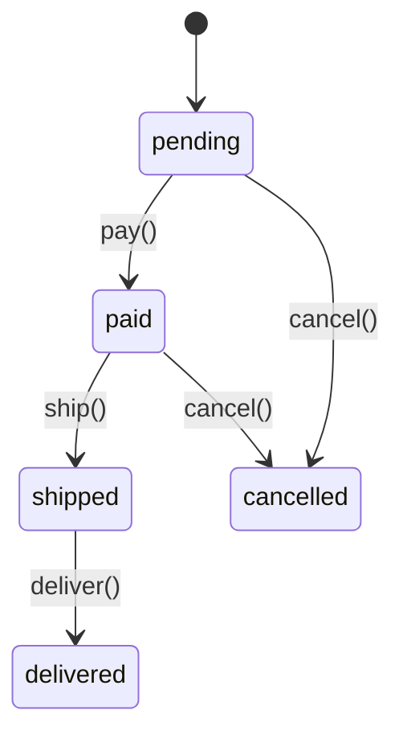

# State Workflows Example

This example builds a realistic order processing workflow using Specwright's `StateMachine`, showing transitions, hooks, history tracking, and combination with `@spec`.

## The Order Lifecycle



An order can follow the happy path (pending → paid → shipped → delivered) or be cancelled before shipping.

## Implementation

```python
from specwright import StateMachine, spec, transition


class OrderProcessor(StateMachine):
    states = ["pending", "paid", "shipped", "delivered", "cancelled"]
    initial_state = "pending"
    track_history = True

    def __init__(self, order_id: str) -> None:
        super().__init__()
        self.order_id = order_id

    @transition(from_state="pending", to_state="paid")
    @spec
    def pay(self, amount: float) -> str:
        """Process payment for the order."""
        return f"Order {self.order_id}: payment of ${amount:.2f} received"

    @transition(from_state="paid", to_state="shipped")
    @spec
    def ship(self, tracking: str) -> str:
        """Ship the order with a tracking number."""
        return f"Order {self.order_id}: shipped (tracking: {tracking})"

    @transition(from_state="shipped", to_state="delivered")
    @spec
    def deliver(self) -> str:
        """Mark the order as delivered."""
        return f"Order {self.order_id}: delivered"

    @transition(from_state=["pending", "paid"], to_state="cancelled")
    @spec
    def cancel(self, reason: str) -> str:
        """Cancel the order (only if not yet shipped)."""
        return f"Order {self.order_id}: cancelled ({reason})"

    # Lifecycle hooks
    def on_enter_paid(self) -> None:
        print(f"  [hook] Sending payment confirmation for {self.order_id}")

    def on_enter_shipped(self) -> None:
        print(f"  [hook] Sending shipping notification for {self.order_id}")

    def on_exit_pending(self) -> None:
        print(f"  [hook] Order {self.order_id} is no longer pending")
```

## Happy Path

```python
>>> order = OrderProcessor("ORD-001")
>>> order.state
'pending'

>>> order.pay(99.99)
  [hook] Order ORD-001 is no longer pending
  [hook] Sending payment confirmation for ORD-001
'Order ORD-001: payment of $99.99 received'

>>> order.ship("TRACK-12345")
  [hook] Sending shipping notification for ORD-001
'Order ORD-001: shipped (tracking: TRACK-12345)'

>>> order.deliver()
'Order ORD-001: delivered'

>>> order.state_history
['pending', 'paid', 'shipped', 'delivered']
```

## Cancellation Path

```python
>>> order2 = OrderProcessor("ORD-002")
>>> order2.cancel("customer changed mind")
  [hook] Order ORD-002 is no longer pending
'Order ORD-002: cancelled (customer changed mind)'

>>> order2.state
'cancelled'
>>> order2.state_history
['pending', 'cancelled']
```

## Invalid Transition

```python
>>> order3 = OrderProcessor("ORD-003")
>>> order3.pay(50.00)
>>> order3.ship("TRACK-99999")
>>> order3.cancel("too late")
# InvalidTransitionError: Cannot transition from 'shipped' to 'cancelled'
# via 'cancel'. Valid source state(s): paid, pending
```

The framework prevents cancelling an order that has already shipped — you don't need to write that check yourself.

## Type Safety via @spec

Since the transition methods are also `@spec`-decorated, types are validated:

```python
>>> order = OrderProcessor("ORD-004")
>>> order.pay("not a number")
# InputValidationError: Input validation failed for 'pay':
#   - Parameter 'amount': expected <class 'float'>, got str ('not a number')
```

## What Each Layer Does

| Layer | Validates |
|-------|-----------|
| `@transition` | Current state allows this operation |
| `@spec` | Arguments and return values match type hints |
| Hooks | Side effects (notifications, logging) happen automatically |
| History | Full audit trail of state changes |

## Complete Source

The full example is at [`examples/order_processing.py`](https://github.com/specwright/specwright/blob/main/examples/order_processing.py).

!!! tip "Why this matters for LLM-assisted development"
    The state machine definition is a **complete specification** of the workflow. An LLM can read the class and know exactly: what states exist, which transitions are valid, what arguments each transition takes, and what type it returns. There's no ambiguity about whether you can cancel a shipped order — the state machine makes it structurally impossible.
