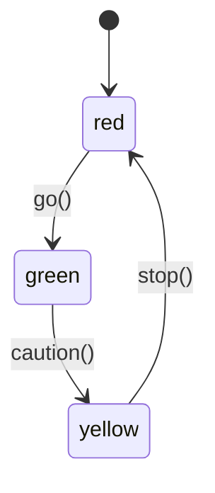
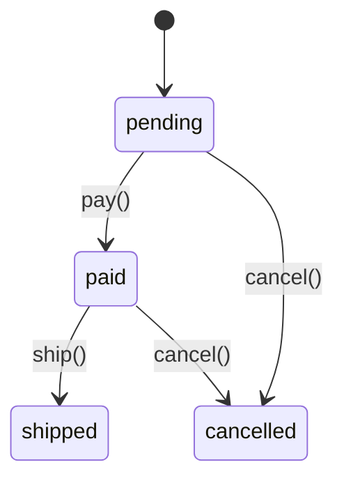

# State Machines

Specwright's `StateMachine` base class enforces valid state transitions at runtime. You declare the states, define transitions as decorated methods, and the framework prevents impossible state changes.

## Basic Usage

```python
from specwright import StateMachine, transition

class TrafficLight(StateMachine):
    states = ["red", "green", "yellow"]
    initial_state = "red"

    @transition(from_state="red", to_state="green")
    def go(self):
        return "Light turned green"

    @transition(from_state="green", to_state="yellow")
    def caution(self):
        return "Light turned yellow"

    @transition(from_state="yellow", to_state="red")
    def stop(self):
        return "Light turned red"
```

```python
>>> light = TrafficLight()
>>> light.state
'red'
>>> light.go()
'Light turned green'
>>> light.state
'green'
>>> light.stop()  # Can't go from green to red!
# InvalidTransitionError: Cannot transition from 'green' to 'red'
# via 'stop'. Valid source state(s): yellow
```

## State Diagram

Here's the traffic light as a state diagram:



## Defining States and Transitions

### Required Class Attributes

Every `StateMachine` subclass must define:

- `states` — a list of valid state names (strings)
- `initial_state` — the starting state (must be in `states`)

```python
class MyMachine(StateMachine):
    states = ["idle", "running", "done"]
    initial_state = "idle"
```

### The @transition Decorator

Mark methods as state transitions:

```python
@transition(from_state="idle", to_state="running")
def start(self):
    """Begin processing."""
    return "Started"
```

- `from_state` — the state(s) the machine must be in for this method to execute
- `to_state` — the state the machine moves to after the method succeeds

### Multiple Source States

A transition can be valid from multiple states:

```python
@transition(from_state=["pending", "paid"], to_state="cancelled")
def cancel(self, reason: str) -> str:
    """Cancel the order (only before shipping)."""
    return f"Cancelled: {reason}"
```



## Class Validation

Specwright validates state machine classes at **definition time** (when the class body is executed):

```python
# Invalid initial state
class Bad(StateMachine):
    states = ["a", "b"]
    initial_state = "c"  # InvalidStateError — "c" not in states
```

```python
# Transition references invalid state
class Bad(StateMachine):
    states = ["a", "b"]
    initial_state = "a"

    @transition(from_state="a", to_state="z")  # InvalidStateError — "z" not in states
    def go(self):
        pass
```

```python
# Empty states
class Bad(StateMachine):
    states = []  # InvalidStateError — must define at least one state
    initial_state = "a"
```

## State History

Opt into tracking every state the machine visits:

```python
class Tracked(StateMachine):
    states = ["a", "b", "c"]
    initial_state = "a"
    track_history = True  # Enable history tracking

    @transition(from_state="a", to_state="b")
    def go_b(self): pass

    @transition(from_state="b", to_state="c")
    def go_c(self): pass

sm = Tracked()
sm.go_b()
sm.go_c()
sm.state_history  # ["a", "b", "c"]
```

History is disabled by default. When disabled, `state_history` returns an empty list.

!!! note
    `state_history` always returns a **copy** of the internal list, so modifying it won't affect the machine.

## Lifecycle Hooks

Define `on_enter_<state>` and `on_exit_<state>` methods to run code automatically during transitions:

```python
class WithHooks(StateMachine):
    states = ["active", "suspended", "terminated"]
    initial_state = "active"

    @transition(from_state="active", to_state="suspended")
    def suspend(self):
        return "Suspended"

    @transition(from_state="suspended", to_state="terminated")
    def terminate(self):
        return "Terminated"

    def on_exit_active(self):
        print("Leaving active state")

    def on_enter_suspended(self):
        print("Entering suspended state")

    def on_exit_suspended(self):
        print("Leaving suspended state")
```

**Hook execution order:**

1. Transition method executes
2. `on_exit_<old_state>` runs (if defined)
3. State updates to the new value
4. `on_enter_<new_state>` runs (if defined)

!!! important "Hooks don't run on failed transitions"
    If the transition method raises an exception, hooks are not called and the state doesn't change.

## Exception Safety

If a transition method raises an exception, the state remains unchanged:

```python
class Safe(StateMachine):
    states = ["idle", "running"]
    initial_state = "idle"

    @transition(from_state="idle", to_state="running")
    def start(self):
        raise RuntimeError("Engine failed")

sm = Safe()
try:
    sm.start()
except RuntimeError:
    pass

sm.state  # Still "idle" — the transition was rolled back
```

## Custom __init__

Subclasses can have custom constructors. Just call `super().__init__()`:

```python
class OrderProcessor(StateMachine):
    states = ["pending", "paid", "shipped"]
    initial_state = "pending"

    def __init__(self, order_id: str) -> None:
        super().__init__()
        self.order_id = order_id

    @transition(from_state="pending", to_state="paid")
    def pay(self, amount: float) -> str:
        return f"Order {self.order_id}: paid ${amount:.2f}"
```

## Combining with @spec

Use `@spec` on transition methods for full type validation:

```python
class Machine(StateMachine):
    states = ["idle", "done"]
    initial_state = "idle"

    @transition(from_state="idle", to_state="done")
    @spec
    def finish(self, result: str) -> str:
        """Complete the task."""
        return f"done: {result}"
```

!!! note "Decorator order"
    `@transition` must be the **outer** decorator and `@spec` the inner one. This ensures the transition logic runs first (checking state), then `@spec` validates types.

## Transition Metadata

Every `@transition`-decorated method carries a `__transition__` attribute with a `TransitionMeta` dataclass:

```python
meta = Machine.finish.__transition__
meta.from_states  # frozenset({"idle"})
meta.to_state     # "done"
```

This metadata is frozen (immutable) and used by `specwright validate` and `specwright docs` for introspection.

## Inheritance

State machines can be extended through subclassing:

```python
class Base(StateMachine):
    states = ["a", "b"]
    initial_state = "a"

    @transition(from_state="a", to_state="b")
    def go(self): pass

class Extended(Base):
    states = ["a", "b", "c"]

    @transition(from_state="b", to_state="c")
    def go_further(self): pass
```

!!! tip "Why this matters for LLM-assisted development"
    State machines make valid transitions **explicit and machine-readable**. When an LLM sees a state machine class, it knows exactly which states exist, which transitions are allowed, and what the current state is. This eliminates an entire class of bugs where generated code attempts impossible operations — like shipping an order that hasn't been paid for.

## Common Pitfalls

!!! warning "Don't forget super().__init__()"
    If you override `__init__`, you must call `super().__init__()` or the state won't be initialized:
    ```python
    def __init__(self, order_id: str):
        super().__init__()  # Required!
        self.order_id = order_id
    ```

!!! warning "Transition decorator must be outermost"
    When combining `@transition` with `@spec`, `@transition` goes on top:
    ```python
    @transition(from_state="a", to_state="b")  # Outer
    @spec                                        # Inner
    def go(self, x: int) -> str:
        """Go."""
        return str(x)
    ```
